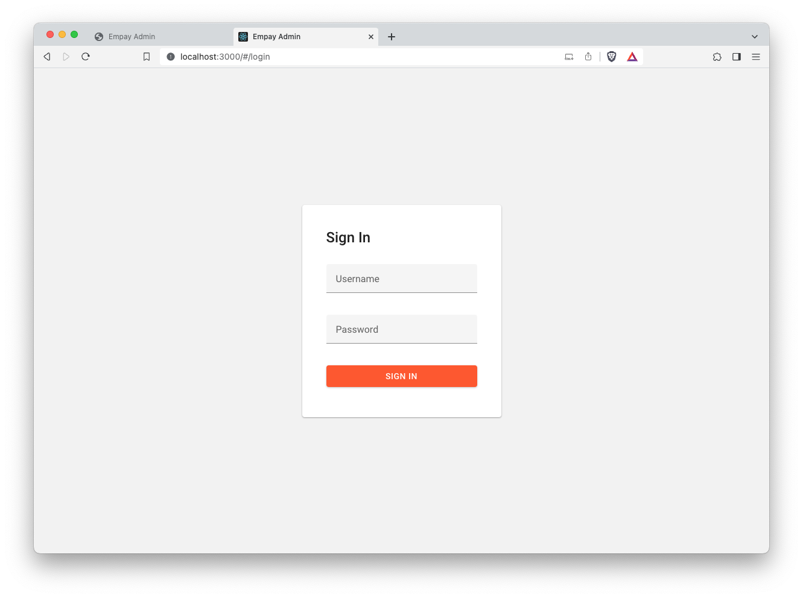
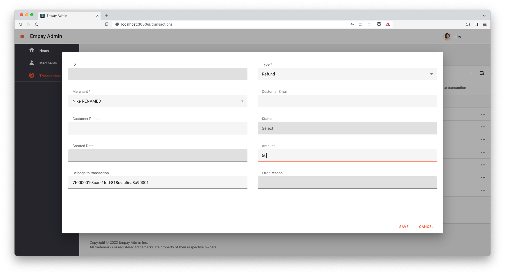

# Introduction
This is an example React front-end application for the Empay backend. 

# Requirements
- npm

# Compile and start

```
$ npm install
```
```
$ npm start
```

This application requires a running backend at localhost on port 8080.

# Usage help
## Login



### User roles
#### Administrator users
A demo administrator user is available with the following credentials: 
```
Username: admin
Password: pass123
```
Administrator users can:

- View all merchants
- Create, update and delete merchants
- View transactions belonging to any merchant

Administrator users can not:
- Create new transactions

#### Merchant users
A set of demo merchant users are available. Check the application console after startup for a 
complete list.

Example merchant user:
```
Username: nike
Password: pass123
```

Merchant users can: 

- View the merchant they are assigned to
- List transactions for their own merchant
- Create new transactions

Merchant users can not:

- View merchants other than their own
- Create, edit or delete merchants
- View transactions for merchants other than their own

## Merchants
### View and search merchants
#### View as an administrator user
All merchants are available. New merchants can be created. 


#### View as a merchant user
Only the own merchant of the current user is available.
Buttons to create new merchants, edit and delete merchants are visible but will be removed in 
future versions. 


### Create a new merchant
As administrator:


### Edit a merchant
As administrator:


> Merchants in status **Inactive** are not allowed to make transactions.


### Delete a merchant
As administrator:

The merchant **Nike** cannot be deleted because it has transactions.

Merchant **Fila** however can be successfully deleted.


## Transactions

### List and search transactions
As administrator:


As merchant:


### Create a new transaction
> Only merchant users can create transactions


#### Charge transaction


> Total transaction sum of merchant **Nike** increased by 100.00. 


#### Refund transaction error
Create a REFUND transaction related to the previously created CHARGE transaction.
Note that the **amount** of **200** is greater than the amount of **100** of the charge transaction.
> Field **Belongs to transaction** is mandatory for **Refund** transactions.


Transaction is created in status **Error**.

Expand column **Error reason** to view details about the status. 

#### Refund transaction success
Create a **REFUND** transaction related to the previously created **CHARGE** transaction. 
Note that the **amount** of **50** is **less** than the amount of **100** of the charge 
transaction.
> Field **Belongs to transaction** is mandatory for **Refund** transactions.


Transaction is created in status **Approved**.

Total transaction sum of merchant **Nike** is decreased by **50**.


